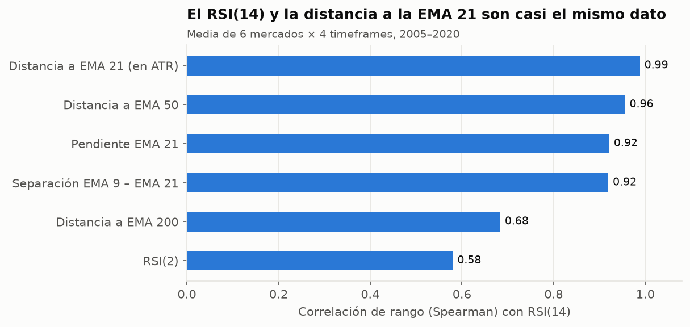
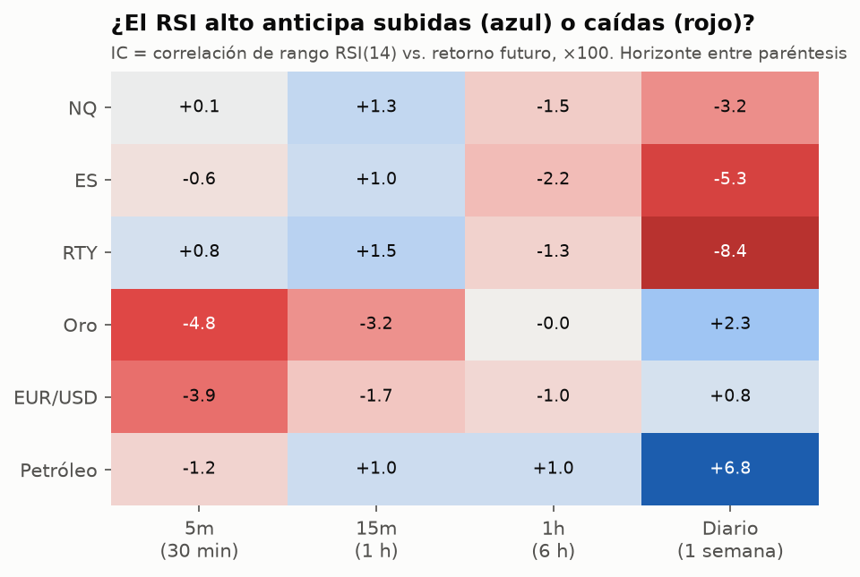
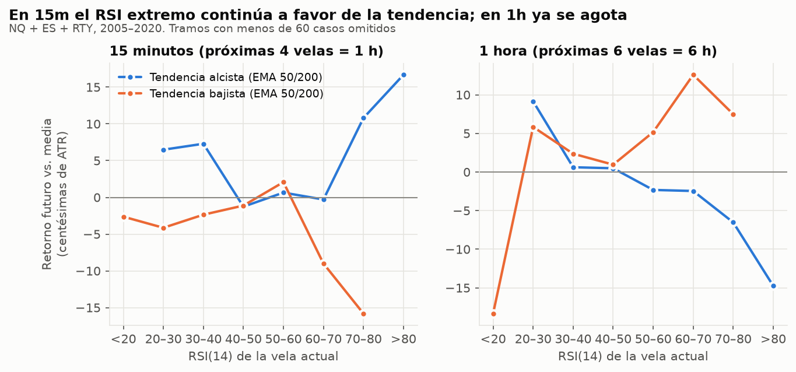
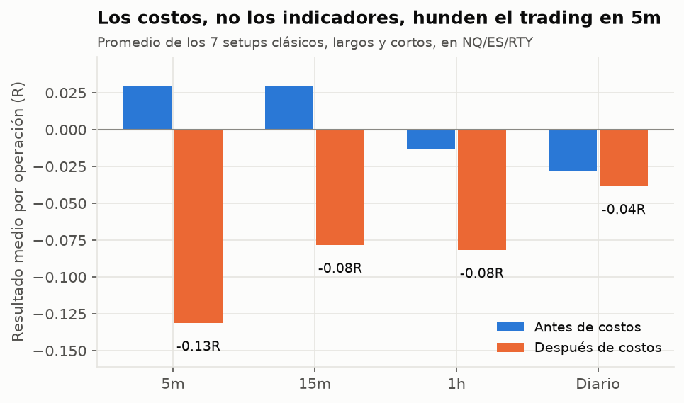
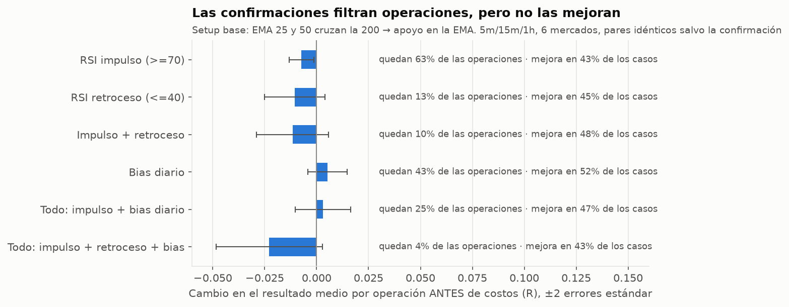
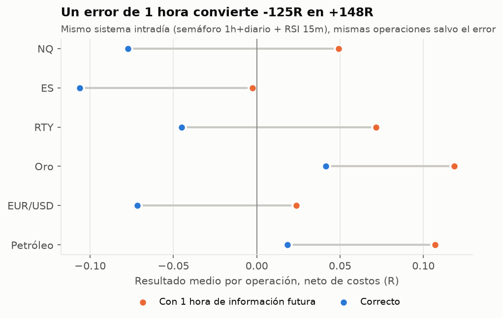
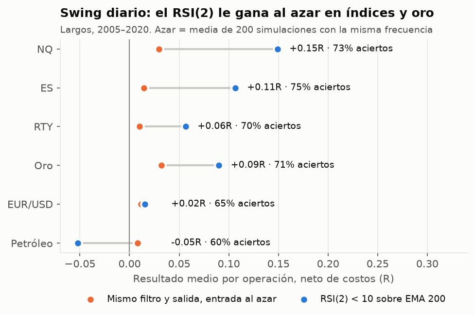
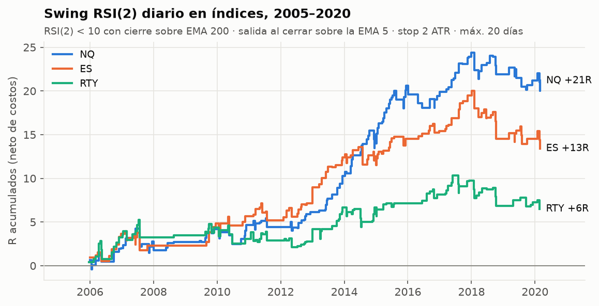

# EMAs + RSI: qué funciona de verdad

**Estudio cuantitativo sobre 15 años de datos (2005–2020), 6 mercados, 4 timeframes y más de
5.500 combinaciones de reglas.** Objetivo: encontrar qué relaciones y confirmaciones entre EMAs,
RSI y el precio tienen ventaja real después de costos, y reducirlas a reglas simples.

> Para scalping (1m, 3m, 5m) con más indicadores y confirmaciones, ver
> [`research/scalping/REPORT.md`](../scalping/REPORT.md).

---

## Resumen para el trader

1. **El RSI(14) y la distancia del precio a la EMA 21 son casi el mismo dato** (correlación de
   rango 0,99). "Precio sobre la EMA *y* RSI > 50" no son dos confirmaciones: es una sola contada
   dos veces.
2. **Por eso apilar confirmaciones no mejora las entradas.** Se probó la secuencia completa
   "EMA 25 y 50 cruzan la EMA 200 → RSI en sobrecompra/sobreventa → bias diario a favor → entrada
   en el apoyo a la EMA" con 2.688 variantes. Cada confirmación cambia el resultado por operación
   entre −0,02R y +0,005R (nada), mejora solo en 43–52% de los casos (una moneda al aire) y elimina
   entre el 37% y el 96% de las operaciones. **Filtran cantidad, no mejoran calidad.**
3. **El RSI significa cosas opuestas según el timeframe.** En 15m, dentro de una tendencia alcista,
   un RSI > 70 anticipa *más* subida: es fuerza, no señal de venta. En 1h y en diario, el RSI
   extremo se revierte.
4. **En intradía (5m, 15m), ningún setup EMA/RSI probado le gana a los costos de forma consistente
   en NQ ni en ES:** los pocos positivos no se repiten en el otro índice ni en las dos mitades del
   período. Antes de costos, 2 de cada 3 variantes son apenas positivas; la comisión y el deslizamiento
   (≈0,18R por operación en 5m, ≈0,12R en 15m) las vuelven perdedoras. Operar menos y en un
   timeframe mayor es, por sí solo, la mejora más grande.
5. **Lo que sí pasó todas las pruebas es tu misma idea llevada al gráfico diario:** tendencia a
   favor (cierre sobre la EMA 200) + sobreventa (RSI(2) < 10) + salida cuando el precio recupera la
   EMA 5. En NQ, ES y RTY: 70–75% de aciertos, +0,06 a +0,15R por operación netos, positivo en las
   90 variantes de parámetros probadas (y en ambas mitades del período en el 89–97% de ellas) y muy
   por encima de entradas al azar. Son ~9 operaciones por año por índice, de 3 a 4 días cada una.
6. **NQ, ES y RTY se mueven juntos** (correlación 0,90 en 15m, 0,93 en diario). La misma señal en
   dos de ellos es la misma apuesta dos veces.
7. **Cuidado con los backtests que circulan.** Un error de alineación de solo 1 hora (usar la vela
   de 1h que todavía no cerró) convirtió un sistema intradía que pierde −125R en uno que "gana"
   +148R. Lo cometió la primera versión de este mismo estudio y lo detectó la verificación final.

### El setup validado: swing diario "EMA 200 + RSI(2)"

| # | Regla |
|---|---|
| 1 | **Bias.** Solo largos, y solo si el **cierre diario está sobre la EMA 200**. |
| 2 | **Confirmación de sobreventa.** El **RSI(2) diario cierra por debajo de 10**. |
| 3 | **Entrada.** Comprar en la **apertura de la sesión siguiente** (entrar al cierre de la vela de señal da un resultado casi idéntico). |
| 4 | **Stop.** 2 ATR(14) diarios por debajo del precio de entrada. |
| 5 | **Salida.** Vender en la apertura siguiente al **primer cierre por encima de la EMA 5**. Si pasan 20 sesiones, salir al cierre. |

El indicador [`NinjaTrader/Indicators/EmaRsiSwing.cs`](../../NinjaTrader/Indicators/EmaRsiSwing.cs)
dibuja exactamente estas reglas en un gráfico diario de NinjaTrader 8. Una emulación vela por vela
de su lógica reproduce el backtest operación por operación (142 de 142 en NQ, 126 de 126 en ES).

### Reglas intradía que sí respalda la estadística

No son un sistema rentable por sí mismas; son filtros para **dejar de hacer lo que pierde**:

- **No vendas en 15m solo porque el RSI supera 70** si la tendencia de EMAs (precio y EMA 50 sobre la
  EMA 200) es alcista: es el tramo con mejor retorno futuro de todos.
- **Cortos solo cuando 1h y diario están bajistas.** Ese filtro lleva los cortos de NQ/ES de −0,09R a
  ≈0R por operación. En los largos no ayuda.
- **Una herramienta por función:** EMA para la dirección *o* RSI para la sobreextensión, no ambas en el
  mismo timeframe como si fueran independientes.
- **Menos operaciones, stops más amplios, timeframe más alto:** en 5m los costos son el 18% del riesgo
  de cada operación.

---

## 1. Datos y método

| | |
|---|---|
| **Mercados** | NAS100 (≈NQ), SPX500 (≈ES), US2000 (≈RTY), oro (≈GC), EUR/USD (≈6E), petróleo WTI (≈CL) |
| **Fuente** | Velas de 1 minuto de Oanda (CFD), enero 2005 – mayo 2020, [FutureSharks/financial-data](https://github.com/FutureSharks/financial-data). ~27 millones de velas. |
| **Timeframes** | 5m, 15m, 1h y diario (sesión estilo CME: 18:00 → 17:00 ET), en hora de Nueva York |
| **Indicadores** | EMA 5/9/21/25/50/200, RSI(2), RSI(14), ATR(14). Mismas fórmulas que NinjaTrader 8 (EMA α=2/(n+1); RSI y ATR con suavizado de Wilder). |
| **Ejecución** | Señal al cierre de la vela, entrada en la apertura de la siguiente. Si stop y objetivo caen en la misma vela, se asume el stop. Los timeframes mayores solo aportan velas **ya cerradas**. |
| **Intradía (5m/15m)** | Entradas 09:30–15:00 ET, todo cerrado a las 16:00 ET, sin overnight. |
| **Costos ida y vuelta** | NQ 1,0 pt · ES 0,5 pt · RTY 0,3 pt · GC 0,30 USD · 6E 1,5 pips · CL 0,03 USD (comisión + deslizamiento) |
| **Medida** | **R** = múltiplos del riesgo inicial (distancia al stop). Comparable entre mercados y años. |
| **Validación** | In-sample 2005–2012 vs. out-of-sample 2013–2020; control con entradas aleatorias; rejillas de parámetros; comparación por pares (misma regla con y sin una confirmación). Los parámetros base son los de libro, no optimizados. |

**Cómo se verificó el código.** El simulador da ≈0R sobre un paseo aleatorio y detecta como ventaja
falsa (+0,37R) una trampa de look-ahead puesta a propósito. Además, cada regla que terminó en un
indicador se reescribió tal como la ejecutaría NinjaTrader y se comparó operación por operación con
el backtest. Esa comparación encontró un error real en la primera versión del estudio multi-timeframe
(sección 6) y todos los resultados de este informe ya están corregidos.

---

## 2. Hallazgo 1 — RSI y EMAs miden casi lo mismo



El RSI(14) es una forma normalizada de medir cuánto se alejó el precio de su media reciente. Su
correlación de rango con la distancia a la EMA 21 (en ATRs) es 0,99; con la separación EMA 9–EMA 21,
0,92; con la pendiente de la EMA 21, 0,92. En la práctica, cruces de EMAs rápidas, pendiente de la
EMA y RSI son **el mismo termómetro con distinta escala**. Esa es la razón de fondo del hallazgo 4.

---

## 3. Hallazgo 2 — El RSI significa cosas opuestas según el timeframe



El IC (information coefficient) mide si un RSI alto anticipa subidas (azul: el RSI funciona como
**impulso**) o caídas (rojo: funciona como **sobrecompra / reversión**). En finanzas, un IC de ±3 a ±5
ya es relevante.

- **Índices (NQ, ES, RTY):** en 15m el RSI es impulso; en 1h ya es reversión, y en diario la reversión
  es fuerte (−3 a −8). Por eso "comprar la sobreventa" funciona en diario y no en 5m.
- **Oro y EUR/USD:** intradía son de reversión.
- **Petróleo diario:** impulso fuerte (+6,8): las tendencias del crudo continúan. Por eso el swing de
  sobreventa no le sirve al petróleo (sección 7).



Dentro de una tendencia alcista de EMAs (precio y EMA 50 sobre la EMA 200), en 15m el RSI entre 70 y
100 es el tramo con **mejor** retorno futuro (en NQ, t-stat 5–6 en 15m y 7–8 en 5m). Vender "porque
está sobrecomprado" en ese contexto es operar contra la estadística. En tendencia bajista pasa lo
simétrico: el RSI < 30 no rebota (sigue levemente a la baja). En 1h, en cambio, un RSI > 80 en tendencia alcista ya anticipa una
corrección.

---

## 4. Hallazgo 3 — Los setups clásicos, uno por uno

Se probaron 7 setups en largo y en corto, 6 mercados, 4 timeframes y 2 tipos de salida (672
combinaciones). Resultado neto medio por operación en **largos**, NQ y ES (en R):

| Setup | NQ 5m | ES 5m | NQ 15m | ES 15m | NQ 1h | ES 1h | NQ diario | ES diario |
|---|---:|---:|---:|---:|---:|---:|---:|---:|
| S1 Cruce EMA 9/21 | −0,12 | −0,12 | −0,11 | −0,07 | +0,02 | −0,02 | +0,35 | +0,22 |
| S2 Cruce 9/21 + RSI>50 + EMA200 | −0,12 | −0,12 | −0,12 | −0,07 | −0,04 | −0,07 | +0,30 | +0,23 |
| S3 RSI 30/70 contra-tendencia | −0,17 | −0,18 | −0,12 | −0,12 | −0,03 | +0,01 | −0,14 | −0,02 |
| S4 RSI 30/70 a favor de tendencia | −0,26 | −0,27 | −0,16 | −0,08 | −0,03 | −0,07 | 0,00 | −0,28 |
| S5 RSI(2) < 10 sobre EMA 200 | −0,17 | −0,21 | −0,12 | −0,13 | −0,03 | −0,05 | **+0,15** | **+0,11** |
| S6 Retroceso a EMA 21 en tendencia | −0,15 | −0,14 | −0,11 | −0,06 | −0,03 | −0,07 | +0,06 | +0,07 |
| S7 Impulso: RSI cruza 70 en tendencia | +0,03 | −0,05 | 0,00 | −0,04 | +0,02 | −0,13 | +0,26 | +0,24 |

Los cortos dan peor en casi todas las celdas (los índices subieron fuerte en 2009–2020).

- En 5m y 15m, **13 de 336** combinaciones son positivas y **289 pierden en ambas mitades** del
  período. No es mala suerte: es sistemático.
- Agregar filtros en el **mismo** timeframe (S2 frente a S1, S4 frente a S3) no arregla nada, como
  anticipaba el hallazgo 1.
- En diario casi todo lo de largo es positivo. El cruce 9/21 da mucho por operación pero ocurre solo
  5–6 veces por año y su evidencia estadística es débil (t 1,1–1,8); el RSI(2) (S5) es el más sólido y
  se analiza en la sección 7.



En 5m, con un stop de 2 ATR, el riesgo típico es chico y el costo fijo de cada operación se lleva
≈0,18R en NQ/ES; en 15m ≈0,12R; en 1h ≈0,08R; en diario ≈0,01R.

---

## 5. Hallazgo 4 — Las confirmaciones (cruce 25/50 sobre la 200 + RSI + bias + apoyo)

Se probó la secuencia completa como una máquina de estados, en largo y en corto:

1. **Cruce:** la EMA 25 y la EMA 50 quedan ambas del mismo lado de la EMA 200. El setup queda armado
   100 velas o hasta que la EMA 50 vuelva a cruzar la 200.
2. **Confirmación RSI(14):** ninguna · *impulso* (el RSI llegó a 70 después del cruce) · *retroceso*
   (el RSI bajó a 40 en el retroceso) · ambas.
3. **Bias diario:** régimen EMA 50/200 de la sesión diaria anterior a favor, o sin filtro.
4. **Entrada en el apoyo:** la vela toca la EMA 25 o la EMA 50 y cierra del lado de la tendencia;
   solo el **primer** apoyo o **cualquier** apoyo.
5. **Salida:** bracket 2R (stop 1,5 ATR, objetivo 3 ATR) o trailing (stop 2 ATR, salida al cerrar del
   otro lado de la EMA 50).

**Tu ejemplo, literal** (cruce 25/50 sobre la 200, RSI en sobrecompra después del cruce, bias diario
alcista, primer apoyo en la EMA 25), en largos. Neto de costos y, entre paréntesis, antes de costos:

| Timeframe | Salida | NQ | ES | RTY | Oro | EUR/USD | Petróleo |
|---|---|---:|---:|---:|---:|---:|---:|
| 5m | bracket 2R | −0,25 (0,00) | −0,24 (+0,06) | −0,21 (−0,01) | −0,10 (+0,07) | −0,11 (+0,04) | −0,28 (−0,13) |
| 5m | trailing EMA 50 | −0,15 (+0,03) | −0,16 (+0,06) | −0,12 (+0,03) | −0,03 (+0,10) | −0,08 (+0,03) | −0,11 (0,00) |
| 15m | bracket 2R | −0,26 (−0,09) | −0,13 (+0,07) | −0,03 (+0,11) | −0,13 (−0,02) | −0,06 (+0,04) | −0,08 (+0,02) |
| 15m | trailing EMA 50 | −0,23 (−0,10) | −0,13 (+0,02) | 0,00 (+0,10) | +0,01 (+0,09) | −0,11 (−0,03) | +0,01 (+0,08) |
| 1h | bracket 2R | −0,13 (−0,03) | −0,05 (+0,07) | −0,20 (−0,12) | −0,44 (−0,36) | −0,13 (−0,07) | −0,03 (+0,03) |
| 1h | trailing EMA 50 | +0,24 (+0,31) | −0,15 (−0,06) | −0,11 (−0,05) | −0,32 (−0,27) | −0,32 (−0,27) | +0,22 (+0,27) |

En 15m ocurre 13–26 veces por año por mercado; en 1h, 4–8; en diario, 3–6 veces **en 15 años**.
El único resultado llamativo (NQ 1h con trailing, +0,24R) no se repite en ES ni en RTY, que se mueven
un 90% igual que NQ: es más probable que sea ruido que un patrón.



Para aislar el aporte de **cada** confirmación, se comparó cada variante con su gemela idéntica sin
esa confirmación (mismo mercado, timeframe, lado, EMA de apoyo y salida), usando el resultado **antes
de costos** para que el menor número de operaciones no distorsione la comparación. Ninguna
confirmación mejora el resultado: el bias diario queda dentro del error estadístico, la de impulso
(RSI ≥ 70) incluso lo empeora levemente, y la más estricta (impulso + retroceso + bias) deja solo el
4% de las operaciones sin mejorarlas.

En total, de 1.765 variantes con al menos 20 operaciones en cada mitad del período, **83 (4,7%)**
fueron positivas en ambas mitades, repartidas sin patrón entre mercados y timeframes, y ninguna
supera un t-stat de 1,8. Es lo que se espera del azar con 1.765 intentos.

**Por qué pasa:** EMA 25, EMA 50, RSI(14) y el bias diario se calculan todos con el mismo precio y
miden lo mismo (hallazgo 1). Cuando todos "confirman", no hay información nueva: solo menos
operaciones. Una confirmación útil tiene que medir algo distinto (otro timeframe con otra lógica, como
en la sección 7, u otra fuente de información, como el volumen o la estructura de liquidez).

---

## 6. Hallazgo 5 — El "semáforo" multi-timeframe y el error de 1 hora

Se evaluó un sistema intradía que parecía la solución: dirección por el régimen EMA de 1h y diario
(ambos a favor) y entrada cuando el RSI(14) de 15m sale de 30/70. En la primera versión del estudio dio
+0,06R por operación, 58% de aciertos y 12 de 16 años positivos.

Al traducirlo a NinjaTrader y emularlo vela por vela, los resultados no coincidían. La causa: al
alinear las velas de 1h con las de 15m, el código usaba la vela de 1h **que todavía se estaba
formando** (pandas realineó por etiqueta en vez de desplazar). Con la vela de 1h ya cerrada, que es lo
único que se puede saber en tiempo real:



| | NQ | ES | RTY | Oro | EUR/USD | Petróleo |
|---|---:|---:|---:|---:|---:|---:|
| Con 1h de información futura | +0,05 | 0,00 | +0,07 | +0,12 | +0,02 | +0,11 |
| **Correcto** | **−0,08** | **−0,11** | **−0,05** | **+0,04** | **−0,07** | **+0,02** |

Lo que sí queda del análisis multi-timeframe, ya corregido:

- En la mayoría de los mercados (no en ES) las entradas por RSI siguen siendo algo mejores que entradas
  al azar con el mismo filtro, pero no alcanzan para cubrir los costos en los índices.
- Cuando 15m, 1h y diario están **todos bajistas**, las 2 horas siguientes rinden por debajo de la media
  en los 6 mercados (t-stat −1,5 a −3,8).
- Exigir 1h y diario bajistas mejora los cortos de los 7 setups clásicos en +0,06R de media (en 71% de
  los casos); en NQ/ES los lleva de −0,09R a ≈0R. Para los largos el filtro no ayuda.

**La lección para evaluar cualquier backtest** (propio, de un curso o de internet): si usa un timeframe
mayor, preguntá siempre si la vela mayor ya había cerrado en el momento de la señal. Una hora de
información futura alcanza para inventar un sistema ganador.

---

## 7. El setup que pasó todas las pruebas: swing diario RSI(2) + EMA 200

Es la versión de Larry Connors del "comprar la sobreventa a favor de la tendencia", y en índices es lo
más consistente del estudio:



| Mercado | Ops/año | Aciertos | R medio neto | % medio por op. | Profit factor | 2005–12 | 2013–20 | Días por op. |
|---|---:|---:|---:|---:|---:|---:|---:|---:|
| NQ | 9,9 | 73% | +0,15 | +0,36% | 1,65 | +0,10 | +0,19 | 3,7 |
| ES | 8,8 | 75% | +0,11 | +0,22% | 1,45 | +0,17 | +0,06 | 3,3 |
| RTY | 8,0 | 70% | +0,06 | +0,14% | 1,23 | +0,08 | +0,04 | 3,9 |
| Oro | 6,7 | 71% | +0,09 | +0,26% | 1,45 | +0,12 | +0,04 | 5,0 |
| EUR/USD | 4,9 | 65% | +0,02 | 0,00% | 1,07 | +0,07 | −0,06 | 4,7 |
| Petróleo | 6,1 | 60% | −0,05 | −0,26% | 0,83 | −0,03 | −0,09 | 4,6 |



- **Control al azar:** con el mismo filtro de tendencia y la misma salida, entrar en días al azar da
  +0,01 a +0,03R. El RSI(2) le gana al azar en el 98–100% de 200 simulaciones en NQ, ES, RTY y oro.
- **Robustez:** se probaron 90 variantes por mercado (umbral RSI(2) de 5 a 25; filtro EMA 100, EMA 200
  o ninguno; salida por EMA 5 o por RSI(2) > 70; stop 2 ATR, 3 ATR o sin stop). En NQ, ES y RTY el
  **100%** de las variantes es positivo, y el 89–97% lo es en ambas mitades del período. El umbral 10 es
  el mejor, pero 5 a 25 funcionan todos.
- **Peor período:** 2018 (−10R sumando los tres índices, que dan señales casi los mismos días). En total,
  10 de 16 años positivos. La peor racha fue de −4R en NQ y −7R en ES.
- **La EMA 200 cambia poco el resultado medio en índices** (sin filtro rinde casi igual), pero es la que
  evita comprar caídas en un mercado bajista como 2008, donde en ES no hubo ni una señal.
- **Por qué funciona aquí y no en 5m:** en diario el RSI extremo se revierte (hallazgo 2) y el costo es
  solo ≈0,01R por operación (hallazgo 3).
- **Por qué no en petróleo:** en diario, el crudo es un mercado de impulso (hallazgo 2); comprar su
  sobreventa es ir contra la tendencia real.

---

## 8. Qué NO hacer (según los datos)

- **No apilar confirmaciones del mismo precio** (EMA + RSI + pendiente + cruce) esperando que mejoren la
  entrada: reducen operaciones sin mejorar el resultado.
- **No vender en 15m solo porque el RSI supera 70** con la tendencia de EMAs alcista.
- **No usar cruces de EMA en 5m o 15m como gatillo:** −0,07 a −0,13R por operación y 150–400
  operaciones al año.
- **No abrir cortos intradía** si 1h y diario no están bajistas.
- **No operar NQ y ES a la vez con la misma señal:** correlación 0,90 (15m) y 0,93 (diario).
- **No creer un backtest multi-timeframe** sin verificar que la vela mayor ya había cerrado.

---

## 9. Limitaciones

- Los datos son **CFD de Oanda**, no futuros de CME. Siguen de cerca a NQ/ES/etc., pero el "volumen" es
  de ticks y hay diferencias menores de horario y precio.
- Los datos terminan en **mayo de 2020**; el comportamiento posterior no está medido aquí. Antes de operar
  dinero real, probá el indicador con Playback o en la cuenta Sim101 sobre datos recientes.
- Los costos son supuestos razonables pero fijos. En intradía, cada 0,25 pt adicional de deslizamiento en
  NQ 15m resta ≈0,03R por operación.
- El swing tiene pocas operaciones (~9 por año por índice): la evidencia es sólida en consistencia, pero
  el t-stat individual es moderado (1,8 en ES, 2,6 en NQ).
- Los indicadores de NinjaTrader replican las reglas del backtest pero **no se compilaron en este entorno**
  (no hay NinjaTrader disponible); se verificó su sintaxis y se emuló su lógica en Python.
- Nada de esto es asesoramiento financiero. Es estadística sobre el pasado.

---

## 10. Cómo reproducir

```bash
cd research/ema_rsi
pip install pandas numpy numba matplotlib
python fetch_data.py          # descarga ~1,4 GB de velas de 1 minuto a data/raw
python build_bars.py          # genera 5m / 15m / 1h / diario en data/bars
python study_correlations.py  # Parte A: correlaciones e IC            -> results/ic.csv, rsi_regime.csv
python study_setups.py        # Parte B: 7 setups × 6 mercados × 4 TF   -> results/setups.csv
python study_mtf.py           # Parte C: semáforo multi-timeframe      -> results/mtf_*.csv
python study_robust.py        # Parte D: semáforo + RSI, rejilla y azar -> results/robust_*.csv
python study_swing.py         # Parte E: swing RSI(2) diario            -> results/swing_*.csv
python study_lookahead.py     # Parte F: efecto del error de 1 hora     -> results/lookahead.csv
python study_confirm.py       # Parte G: cruce + confirmaciones + apoyo -> results/confirm.csv
python make_figures.py        # gráficos -> img/
```

Los CSV de `results/` están versionados para que se puedan revisar sin volver a correr nada.
