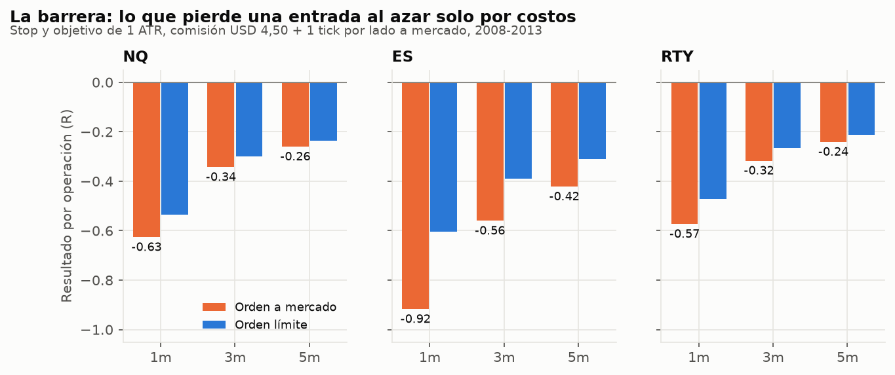
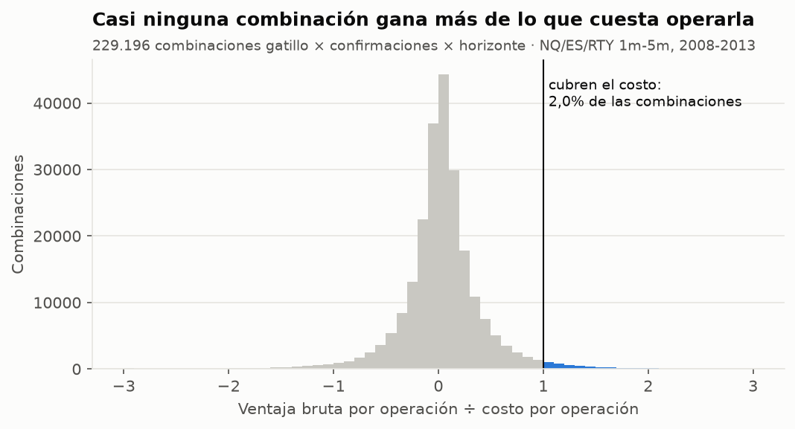
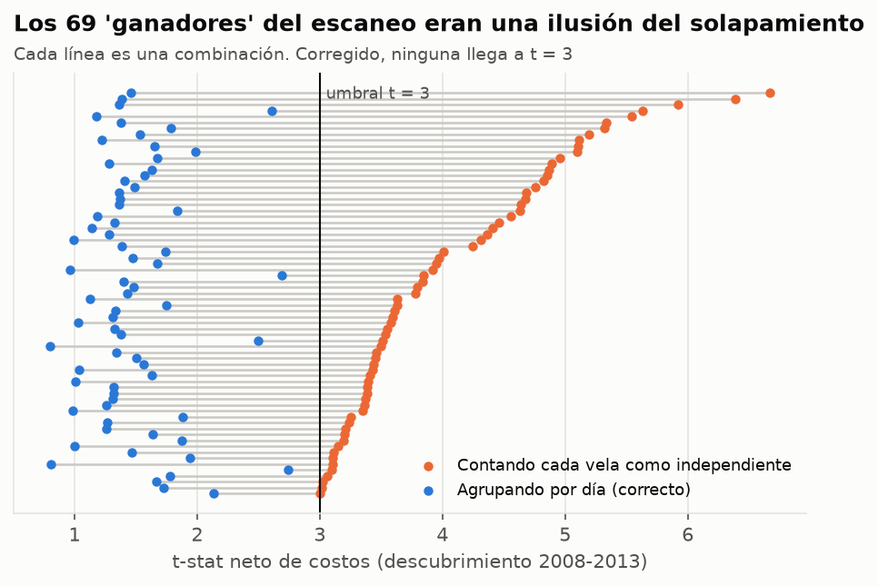

# Scalping con indicadores: qué sobrevive a los costos

**Búsqueda sistemática de combinaciones para scalping en NQ, ES y RTY (futuros de índices),
velas de 1, 3 y 5 minutos, 2008–2020.** 27 gatillos de entrada × 18 confirmaciones (solas y
de a pares) × 2 lados × 4 horizontes × 3 timeframes × 3 mercados: **289.872 combinaciones**
en la primera fase, y después simulación minuto a minuto con órdenes a mercado y límite.

<!-- RESUMEN -->

---

## 1. Método

### Datos
Velas de 1 minuto de Oanda (CFD que replican NQ, ES y RTY), junio 2007 – mayo 2020, agregadas a
3 y 5 minutos en hora de Nueva York. Antes de 2008 faltan demasiados minutos para scalping. El
"volumen" de Oanda es un conteo de ticks que cambia mucho según el año (de 6 a 740 ticks por
minuto en NQ), así que se usa solo **relativo** (volumen de la vela ÷ promedio de las 20
anteriores).

### Tres períodos, uno intocable
| Período | Años | Para qué |
|---|---|---|
| Descubrimiento | 2008–2013 | Buscar. Todo el escaneo se hace aquí. |
| Validación | 2014–2016 | Confirmar lo que sobrevivió al descubrimiento. |
| **Reserva** | **2017–2020** | **No se miró** hasta tener la lista final de candidatos, que se guardó en git (`finalists.json`) antes de evaluarla. |

Con cientos de miles de combinaciones, cientos van a "funcionar" por azar en cualquier período.
La única defensa es confirmar en datos que no participaron de la búsqueda.

### Costos (futuros CME, por contrato)
| | NQ | ES | RTY |
|---|---:|---:|---:|
| Tick | 0,25 pt | 0,25 pt | 0,10 pt |
| Comisión ida y vuelta (USD 4,50) | 0,225 pt | 0,09 pt | 0,09 pt |
| **Orden a mercado** (comisión + 1 tick por lado) | **0,725 pt** (USD 14,50) | **0,59 pt** (USD 29,50) | **0,29 pt** (USD 14,50) |

**Orden límite:** sin deslizamiento en la entrada ni en el objetivo, pero solo se considera
llenada si el precio **atraviesa** el límite por al menos 1 tick (tocarlo no alcanza: en la
realidad hay cola). Los stops siempre se ejecutan a mercado con 1 tick de deslizamiento.

### Ejecución sin mirar el futuro
Señal al cierre de la vela; entrada en la apertura de la siguiente (mercado) o con límite
desde ese momento. Las velas de 15m, 1h y diario solo aportan barras **ya cerradas**; máximo y
mínimo del día anterior, de la noche y del rango de apertura solo existen después de que ese
período terminó. Entradas entre 09:35 y 15:40 ET; todo se cierra a las 16:00 ET. En la Fase 2
cada operación se recorre **minuto a minuto** con las velas de 1m; si stop y objetivo caben en
el mismo minuto se asume el stop.

### Gatillos probados (27)
Retroceso a la EMA 9 en tendencia · recupera VWAP · retroceso a VWAP en tendencia · rechazo de
bandas VWAP 1σ y 2σ · barrido de swing (la lógica de tu `VwapLiquiditySweep`) · barrido del
máximo/mínimo del día anterior · barrido del máximo/mínimo de la noche · ruptura y falsa
ruptura del rango de apertura de 15 min · reentrada y ruptura de squeeze de Bollinger ·
ruptura de Keltner · ruptura de Donchian 20 · estocástico que cruza en extremo · histograma
MACD que cruza 0 · RSI(2) extremo · RSI(7) que sale de 30/70 · CCI que sale de ±100 ·
cambio de Supertrend · ADX > 25 con cruce de DI · envolvente · martillo / estrella fugaz ·
ruptura de inside bar · clímax de volumen · divergencia SMT (NQ contra ES, RTY contra ES) ·
vela de impulso. Más un **control**: entrar en cualquier vela.

### Confirmaciones probadas (18, solas o de a dos)
Precio sobre/bajo la EMA 200 · EMAs 9 > 21 > 50 alineadas · lado del VWAP · precio estirado
más de 1σ del VWAP · régimen EMA de 15m · de 1h · bias diario · hora (apertura 9:35–11,
mediodía 11–14, cierre 14–15:45) · volumen relativo > 1,5 · ADX > 25 · volatilidad alta ·
volatilidad baja · RSI(14) del lado de 50 · precio a favor de la apertura del día · gap a favor
· el mercado hermano del mismo lado de su VWAP.

---

## 2. La barrera de costos

Una entrada **al azar** con stop y objetivo de 1 ATR pierde solo por costos:

- **En 1 minuto:** −0,63R en NQ, −0,92R en ES y −0,57R en RTY por operación. El ATR de 1 minuto
  de ES es de apenas ~3 ticks, así que la comisión y el deslizamiento se comen casi todo el
  riesgo de la operación.
- **En 5 minutos:** −0,24 a −0,42R.
- **Las órdenes límite ayudan poco:** ES 1m pasa de −0,92R a −0,60R. Se ahorra el deslizamiento
  de la entrada, pero las órdenes que se llenan son justamente las que el precio atravesó.

**Cualquier combinación de indicadores tiene que ganar al menos eso antes de dar un centavo.**

---

## 3. Fase 1 — El escaneo masivo

Midiendo el resultado de entrar a mercado y salir a las 3, 6, 12 o 24 velas:

- La ventaja **bruta** típica de una combinación es el **3% de su costo** (mediana). Solo el
  2% de las combinaciones gana, antes de costos, más de lo que cuesta operarla, y entre esas
  hay muchas que lo hacen por azar.
- Hay ventaja bruta estadísticamente real en algunos gatillos (retroceso a la EMA 9 en
  tendencia, martillo/estrella y RSI(2) extremo en 1m), pero chica frente al costo. Esos pasaron
  a la Fase 2.

### La ilusión del solapamiento

El escaneo encontró **69 combinaciones** con t-stat ≥ 3 después de costos. Casi la mitad eran
"entrar en cualquier vela" en días de baja volatilidad. El problema: si cada vela cuenta como una
prueba independiente, 400 velas seguidas de 20 días parecen 400 pruebas, pero son 20. Con
errores agrupados por día (y, por separado, tomando señales sin solapamiento), **ninguna llega a
t = 3** (la mejor queda en 2,7) y ninguna se sostiene en validación.

Es la misma clase de error que el look-ahead del primer estudio: un detalle de cálculo que
fabrica una ventaja que no existe. Muchos backtests de scalping que circulan lo cometen.

### Aparte: el momentum intradía publicado

Gao, Han, Li y Zhou (2018) mostraron que el retorno de la primera media hora (del cierre
anterior a las 10:00) anticipa la última media hora (15:30–16:00). En estos datos aparece antes
de costos en 2008–2013 (52–56% de aciertos) pero no sobrevive a los costos ni se repite en
2014–2016 en ninguno de los tres índices.

<!-- FASE2 -->

<!-- RESERVA -->

<!-- CONCLUSIONES -->
