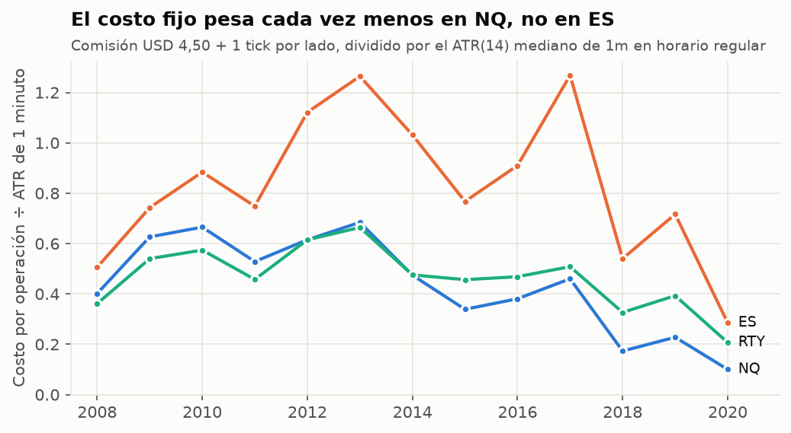
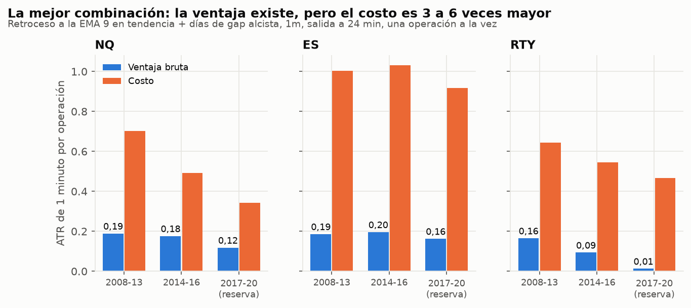

# Scalping con indicadores: qué sobrevive a los costos

**Búsqueda sistemática de combinaciones para scalping en NQ, ES y RTY (futuros de índices),
velas de 1, 3 y 5 minutos, 2008–2020.** 27 gatillos de entrada × 18 confirmaciones (solas y
de a pares) × 2 lados × 4 horizontes × 3 timeframes × 3 mercados: **289.872 combinaciones**
en la primera fase, y después simulación minuto a minuto con órdenes a mercado y límite.

## Resumen para el trader

1. **Ninguna combinación de indicadores dio ventaja de scalping real después de costos.** Se
   evaluaron más de medio millón de combinaciones y simulaciones en 5 fases (escaneo, brackets
   con órdenes límite, reserva, scalping a favor del swing diario y re-escaneo en unidades de
   ATR). Ninguna pasó los criterios fijados de antemano, y los 16 mejores candidatos, evaluados
   una sola vez en 2017–2020, fallaron todos.
2. **El enemigo es el costo, no la falta de indicadores.** Una entrada al azar con stop y objetivo de
   1 ATR pierde −0,92R por operación en ES 1m y −0,63R en NQ 1m solo por comisión y deslizamiento
   (1 tick por lado). En 5m, entre −0,24 y −0,42R.
3. **Algunos gatillos tienen ventaja bruta real, pero chica.** El mejor, el **retroceso a la EMA 9
   con las EMAs 9 > 21 > 50 alineadas, en días de gap alcista** (1m, salida a 24 minutos), gana
   0,12–0,20 ATR por operación antes de costos. Se mantiene fuera de muestra en NQ y ES, pero en el
   momento de la señal el costo es 3 a 6 veces mayor.
4. **Tu barrido de liquidez** (la lógica de `VwapLiquiditySweep`, con y sin el filtro de VWAP a 1σ) da
   ≈0 **antes** de costos en 1m, 3m y 5m, en NQ, ES y RTY. El filtro de VWAP extendido lo empeora
   levemente.
5. **Casi todos los "sistemas ganadores" del escaneo eran ilusiones estadísticas:** 69 combinaciones con
   t > 3 desaparecieron al agrupar por día, porque velas solapadas no son pruebas independientes.
6. **NQ es el único mercado que se acerca.** Su costo relativo cayó de ~0,6 ATR de 1m (2009–2013) a
   ~0,2 (2018–2019) y 0,1 (2020), porque el tick es fijo y el precio subió. ES sigue caro (0,3–1,3 ATR).
   Con los precios actuales de NQ podría quedar cerca del punto de equilibrio. **Eso hay que
   verificarlo con datos recientes**, y para eso está `verify_ninjatrader_export.py` (sección 8).
7. **Lo que sí reduce las pérdidas en scalping** es operar menos y más grande (stop 2 ATR, objetivo
   3 ATR), usar órdenes límite (en ES mejoran el resultado medio de −0,50 a −0,35 puntos por
   operación) y operar NQ antes que ES. Nada de eso crea ventaja por sí solo.


---

## 1. Método

### Datos
Velas de 1 minuto de Oanda (CFD que replican NQ, ES y RTY), junio 2007 – mayo 2020, agregadas a
3 y 5 minutos en hora de Nueva York. Antes de 2008 faltan demasiados minutos para scalping. El
"volumen" de Oanda es un conteo de ticks que cambia mucho según el año (de 6 a 740 ticks por
minuto en NQ), así que se usa solo **relativo** (volumen de la vela ÷ promedio de las 20
anteriores).

### Tres períodos, uno intocable
| Período | Años | Para qué |
|---|---|---|
| Descubrimiento | 2008–2013 | Buscar. Todo el escaneo se hace aquí. |
| Validación | 2014–2016 | Confirmar lo que sobrevivió al descubrimiento. |
| **Reserva** | **2017–2020** | **No se miró** hasta tener la lista final de candidatos, que se guardó en git (`finalists.json`) antes de evaluarla. |

Con cientos de miles de combinaciones, cientos van a "funcionar" por azar en cualquier período.
La única defensa es confirmar en datos que no participaron de la búsqueda.

### Costos (futuros CME, por contrato)
| | NQ | ES | RTY |
|---|---:|---:|---:|
| Tick | 0,25 pt | 0,25 pt | 0,10 pt |
| Comisión ida y vuelta (USD 4,50) | 0,225 pt | 0,09 pt | 0,09 pt |
| **Orden a mercado** (comisión + 1 tick por lado) | **0,725 pt** (USD 14,50) | **0,59 pt** (USD 29,50) | **0,29 pt** (USD 14,50) |

**Orden límite:** sin deslizamiento en la entrada ni en el objetivo, pero solo se considera
llenada si el precio **atraviesa** el límite por al menos 1 tick (tocarlo no alcanza: en la
realidad hay cola). Los stops siempre se ejecutan a mercado con 1 tick de deslizamiento.

### Ejecución sin mirar el futuro
Señal al cierre de la vela; entrada en la apertura de la siguiente (mercado) o con límite
desde ese momento. Las velas de 15m, 1h y diario solo aportan barras **ya cerradas**; máximo y
mínimo del día anterior, de la noche y del rango de apertura solo existen después de que ese
período terminó. Entradas entre 09:35 y 15:40 ET; todo se cierra a las 16:00 ET. En la Fase 2
cada operación se recorre **minuto a minuto** con las velas de 1m; si stop y objetivo caben en
el mismo minuto se asume el stop.

### Gatillos probados (27)
Retroceso a la EMA 9 en tendencia · recupera VWAP · retroceso a VWAP en tendencia · rechazo de
bandas VWAP 1σ y 2σ · barrido de swing (la lógica de tu `VwapLiquiditySweep`) · barrido del
máximo/mínimo del día anterior · barrido del máximo/mínimo de la noche · ruptura y falsa
ruptura del rango de apertura de 15 min · reentrada y ruptura de squeeze de Bollinger ·
ruptura de Keltner · ruptura de Donchian 20 · estocástico que cruza en extremo · histograma
MACD que cruza 0 · RSI(2) extremo · RSI(7) que sale de 30/70 · CCI que sale de ±100 ·
cambio de Supertrend · ADX > 25 con cruce de DI · envolvente · martillo / estrella fugaz ·
ruptura de inside bar · clímax de volumen · divergencia SMT (NQ contra ES, RTY contra ES) ·
vela de impulso. Más un **control**: entrar en cualquier vela.

### Confirmaciones probadas (18, solas o de a dos)
Precio sobre/bajo la EMA 200 · EMAs 9 > 21 > 50 alineadas · lado del VWAP · precio estirado
más de 1σ del VWAP · régimen EMA de 15m · de 1h · bias diario · hora (apertura 9:35–11,
mediodía 11–14, cierre 14–15:45) · volumen relativo > 1,5 · ADX > 25 · volatilidad alta ·
volatilidad baja · RSI(14) del lado de 50 · precio a favor de la apertura del día · gap a favor
· el mercado hermano del mismo lado de su VWAP.

---

## 2. La barrera de costos


Una entrada **al azar** con stop y objetivo de 1 ATR pierde solo por costos:

- **En 1 minuto:** −0,63R en NQ, −0,92R en ES y −0,57R en RTY por operación. El ATR de 1 minuto
  de ES es de apenas ~3 ticks, así que la comisión y el deslizamiento se comen casi todo el
  riesgo de la operación.
- **En 5 minutos:** −0,24 a −0,42R.
- **Las órdenes límite ayudan poco:** ES 1m pasa de −0,92R a −0,60R. Se ahorra el deslizamiento
  de la entrada, pero las órdenes que se llenan son justamente las que el precio atravesó.

**Cualquier combinación de indicadores tiene que ganar al menos eso antes de dar un centavo.**

---

## 3. Fase 1 — El escaneo masivo


Midiendo el resultado de entrar a mercado y salir a las 3, 6, 12 o 24 velas:

- La ventaja **bruta** típica de una combinación es el **3% de su costo** (mediana). Solo el
  2% de las combinaciones gana, antes de costos, más de lo que cuesta operarla, y entre esas
  hay muchas que lo hacen por azar.
- Hay ventaja bruta estadísticamente real en algunos gatillos (retroceso a la EMA 9 en
  tendencia, martillo/estrella y RSI(2) extremo en 1m), pero chica frente al costo. Esos pasaron
  a la Fase 2.

### La ilusión del solapamiento


El escaneo encontró **69 combinaciones** con t-stat ≥ 3 después de costos. Casi la mitad eran
"entrar en cualquier vela" en días de baja volatilidad. El problema: si cada vela cuenta como una
prueba independiente, 400 velas seguidas de 20 días parecen 400 pruebas, pero son 20. Con
errores agrupados por día (y, por separado, tomando señales sin solapamiento), **ninguna llega a
t = 3** (la mejor queda en 2,7) y ninguna se sostiene en validación.

Es la misma clase de error que el look-ahead del primer estudio: un detalle de cálculo que
fabrica una ventaja que no existe. Muchos backtests de scalping que circulan lo cometen.

### Aparte: el momentum intradía publicado

Gao, Han, Li y Zhou (2018) mostraron que el retorno de la primera media hora (del cierre
anterior a las 10:00) anticipa la última media hora (15:30–16:00). En estos datos aparece antes
de costos en 2008–2013 (52–56% de aciertos) pero no sobrevive a los costos ni se repite en
2014–2016 en ninguno de los tres índices.

---

## 4. Fase 2 — Brackets y órdenes límite

Las 135 reglas (gatillo + confirmaciones) con mayor ventaja **bruta** (t ingenuo ≥ 5 en 2008–2013
y ≥ 2 en 2014–2016) se simularon minuto a minuto en los 3 índices. Para cada uno se probaron 3 ejecuciones
(a mercado, límite al cierre de la señal, límite 0,25 ATR mejor) × 4 stops (0,5 a 2 ATR) × 5
objetivos (0,5 a 3 ATR): **24.300 simulaciones.**

- **Ninguna pasa el descubrimiento** (neto > 0 con t agrupado ≥ 3). Solo 198 (0,8%) son positivas en
  2008–2013 y 26 lo son también en 2014–2016, todas con t < 1,8. El mejor t, 2,0 (divergencia SMT en
  ES 3m), pierde en validación.
- **Los gatillos de 1m con más ventaja bruta** (martillo, RSI(2) extremo, retroceso a la EMA 9) **pierden
  todos** una vez simulados con costos. El mejor t en 1m es 0,27.
- **Lo que menos pierde son los brackets anchos:** stop 2 ATR / objetivo 3 ATR queda en −0,20R de media,
  contra −0,92 a −1,00R con stop de 0,5 ATR. Stops más ajustados solo multiplican el costo.
- **Las órdenes límite ayudan poco:** en ES el resultado medio pasa de −0,50 a −0,35 puntos por
  operación, en RTY de −0,23 a −0,20 y en NQ de −0,60 a −0,54. Las órdenes que se llenan son justamente
  las que el precio atraviesa.

## 5. Fase 3 — Primera evaluación en la reserva (2017–2020)

Como ninguna regla cumplió los criterios, se registraron en git (`finalists.json`, commit `aabbd40`)
**las 6 que mejor se veían** en 2008–2016, junto con el criterio de aprobación (neto > 0 con t ≥ 2 en su
mercado de origen, y positivo en al menos 2 de los 3 índices). Recién después se calculó 2017–2020:

| # | Regla (mercado de origen) | 2008–13 | 2014–16 | **2017–20** |
|---|---|---:|---:|---:|
| 1 | NQ 5m corto: retroceso a EMA 9 + régimen 1h bajista + día bajo la apertura, stop 2 / obj. 3 ATR | +0,25 (t 0,9) | +0,51 (t 0,8) | **+1,57 (t 0,8)** |
| 2 | NQ 5m corto: retroceso a EMA 9 + régimen 1h bajista + bajo el VWAP, límite 0,25 ATR, stop 2 / obj. 3 ATR | +0,28 (t 0,9) | +0,43 (t 0,7) | **+1,32 (t 0,6)** |
| 3 | NQ 3m corto: retroceso a EMA 9 + régimen 1h bajista + 9:35–11:00, stop 2 / obj. 3 ATR | +0,14 (t 0,4) | +0,46 (t 0,5) | **+0,04 (t 0,0)** |
| 4 | RTY 5m largo: retroceso a EMA 9 + 14:00–15:45 + gap alcista, límite | +0,03 (t 0,2) | +0,15 (t 0,8) | **−0,02 (t −0,1)** |
| 5 | NQ 1m largo: ruptura de squeeze Bollinger en días de swing activo | +0,20 (t 0,4) | +1,02 (t 1,0) | **+5,06 (t 1,5)** |
| 6 | ES 5m largo: Supertrend en días de swing activo | +0,18 (t 0,5) | +0,16 (t 0,3) | **−0,69 (t −0,9)** |

Puntos netos por operación en el mercado de origen. **Ninguna aprueba:** el mejor t en la reserva es
1,5, y esa misma regla pierde en ES y RTY.

## 6. Fase 4 — Scalping a favor del swing diario

La única ventaja robusta del estudio de EMAs/RSI está en diario (RSI(2) < 10 sobre la EMA 200). Se
probó si hacer scalping **solo en largo y solo los días en que ese swing está abierto** vuelve
rentables los gatillos intradía: 27 gatillos × 3 timeframes × 3 salidas × 2 ejecuciones en 3 índices
(1.458 simulaciones). **Ninguna pasa.** El motivo aparece al descomponer el swing:

| NQ, 2008–2016 | Noche (cierre 16:00 → apertura 09:30) | Día (09:30 → 16:00) |
|---|---:|---:|
| Días con el swing abierto | +0,068% | +0,078% |
| Todos los días | +0,031% | +0,015% |

La ventaja del swing se reparte entre la noche y la sesión, a lo largo de ~3,7 días. La parte intradía
de un solo día es de unas décimas de punto a unos pocos puntos, con t ≈ 1,3: no alcanza para sostener
entradas de scalping.

## 7. Fase 5 — ¿Alcanzaría con los costos de hoy?



El costo en ticks es fijo, pero las velas crecen con el precio. En NQ 1m el costo pasó de ~0,6 ATR
(2009–2013) a ~0,2 ATR (2018–2019) y 0,1 ATR (2020). Hipótesis: las ventajas brutas medidas en
2008–2016, expresadas en ATR, podrían alcanzar con los costos actuales de NQ.

Se re-escaneó todo en unidades de ATR, **antes de costos**, solo con 2008–2016 (229.196 combinaciones).
En bruto las ventajas son sólidas: 226 de las 300 mejores mantienen t agrupado ≥ 3 en descubrimiento
y ≥ 2 en validación. **11** además superan el costo de NQ 2018–2019 y son positivas en al menos 2 de 3
índices. Casi todas son la misma idea: **retroceso a la EMA 9 con EMAs alineadas al alza, en días de
gap alcista, 1m, 24 minutos**. Y el gatillo aporta de verdad: rinde ~0,1 ATR más que entrar en
cualquier minuto de esos mismos días.

Las 10 mejores se registraron (`finalists_phase5.json`, commit `f0be169`) y se evaluaron una vez en
2017–2020, sin solapamiento y netas de costos. Es el segundo uso de la reserva. **Ninguna aprueba**
(criterio: neto > 0 con t ≥ 2 en NQ). Nueve de las diez pierden en NQ (entre −0,12 y −1,57 puntos por
operación) y la décima gana +0,9 puntos con t 0,8, que es ruido.



La descomposición explica por qué, y es el resultado más útil del estudio:

- **La ventaja bruta es real y se sostiene fuera de muestra en NQ y ES** (0,12–0,20 ATR por operación en
  los tres períodos). En RTY se desvanece.
- **Pero el costo en el momento de la señal es 3 a 6 veces mayor.** Las señales aparecen en retrocesos
  tranquilos, con velas más chicas que la mediana, así que el costo pesa más de lo que dice el promedio.
  En NQ 2017–2020: ventaja 0,12 ATR, costo 0,34 ATR. En 2020, con el costo en 0,17 ATR, la regla dio
  +0,9 puntos por operación (t 0,6).

## 8. Cómo verificarlo con tus datos: `verify_ninjatrader_export.py`

Como NQ se acercó al equilibrio a medida que subió su precio, la regla del punto anterior podría ser
marginalmente rentable con los precios actuales. Estos datos terminan en mayo de 2020, así que no lo
puedo afirmar. El script aplica exactamente esa regla a una exportación de NinjaTrader 8:

1. En NinjaTrader: **Tools → Historical Data → Export**, instrumento NQ, tipo *Last*, *Minute*, idealmente
   2 años o más.
2. `python verify_ninjatrader_export.py "NQ 12-26.Last.txt" --commission 4.50 --slippage-ticks 1`
   (con tu comisión real; para ES agregá `--point-value 50`).

Imprime el resultado neto por operación en puntos y en USD, el porcentaje de aciertos, el t-stat
agrupado por día, la ventaja bruta y el costo en ATR, año por año, junto con un **control** (entrar en
cualquier minuto de esos días). Con los datos de NQ 2016–2020 reproduce la evaluación de la reserva
(−0,245 puntos por operación en 3.756 operaciones, frente a −0,24 en el estudio).

**Regla para usarla en real:** solo si el neto es positivo con t ≥ 2 en al menos 2 años de datos
recientes **y** le gana al control. Si no, no tiene ventaja. Primero en simulación.

---

## 9. Conclusiones prácticas

- **No hay combinación mágica de indicadores para scalping.** EMA, RSI, VWAP, Bollinger, Keltner,
  estocástico, MACD, ADX, CCI, Supertrend, patrones de vela, barridos de liquidez, rango de apertura,
  niveles del día anterior y de la noche, divergencia SMT, volumen relativo y filtros de tendencia,
  hora y volatilidad, solos y combinados de a dos. Ninguno supera los costos de forma consistente.
- **La ventaja de un scalper no viene de los indicadores sino de la estructura de costos.** Hace falta
  que el costo por operación sea chico frente al movimiento del minuto: hoy eso favorece a NQ sobre ES.
  Los micros (MNQ, MES) suelen pagar más comisión por punto, así que son más caros para scalping.
- **Si vas a hacer scalping igual:** menos operaciones, stops y objetivos de al menos 1,5–2 ATR, órdenes
  límite en la entrada y el objetivo, NQ antes que ES, y a favor de la tendencia en días de gap.
- **Si buscás la ventaja más sólida de todo el trabajo**, sigue siendo el swing diario RSI(2) + EMA 200
  del primer estudio (`NinjaTrader/Indicators/EmaRsiSwing.cs`), donde el costo es ≈0,01R por operación.
- **Cualquier backtest de scalping que veas** (propio, de un curso o de internet) necesita cuatro cosas
  para ser creíble: costos reales con deslizamiento, errores agrupados por día (o sin solapamiento),
  timeframes mayores con la vela ya cerrada, y una prueba en datos que no participaron de la búsqueda.

---

## 10. Limitaciones

- Datos **CFD de Oanda**, no futuros CME. En años con pocos ticks por minuto (ES 2012–2017) el rango de
  1m de los CFD probablemente subestima el de los futuros, lo que infla el costo en ATR de ES en esos
  años. NQ tiene mejor densidad de datos desde 2014.
- Los datos terminan en **mayo de 2020**; el mercado actual de NQ, con precios mucho más altos, no está
  medido aquí (ver sección 8).
- El modelo de órdenes límite es conservador (hay que atravesar el precio por 1 tick). Un scalper con
  buena posición en la cola podría llenarse más seguido, pero también sufrir más selección adversa.
- La reserva 2017–2020 se usó dos veces (Fases 3 y 5), siempre con finalistas registrados antes en git.
- Nada de esto es asesoramiento financiero. Es estadística sobre el pasado.

---

## 11. Cómo reproducir

```bash
# Requiere los CSV de 1 minuto de research/ema_rsi (python fetch_data.py allí)
# y las barras de 15m/1h/diario (python build_bars.py allí)
cd research/scalping
python build_bars.py                # 1m / 3m / 5m de NQ, ES y RTY desde 06-2007
python features.py                  # indicadores y niveles (≈4 GB en data/features)
python cost_barrier.py              # barrera de costos con entradas al azar
python cost_by_year.py              # costo en ATR por año
python scan.py                      # Fase 1: 289.872 combinaciones (≈3 min)
python recheck.py                   # Fase 1b: t agrupado por día y sin solapamiento
python intraday_momentum.py         # momentum intradía publicado
python phase2.py                    # Fase 2: brackets y órdenes límite (≈20 min, 3 procesos)
python phase4_swing_context.py      # Fase 4: scalping a favor del swing diario
python swing_decomposition.py       # noche vs día del swing
python phase5_atr.py                # Fase 5: re-escaneo en ATR
python holdout.py                   # reserva: finalistas de finalists.json
python holdout_phase5.py            # reserva: finalistas de finalists_phase5.json
python make_figures.py
```


